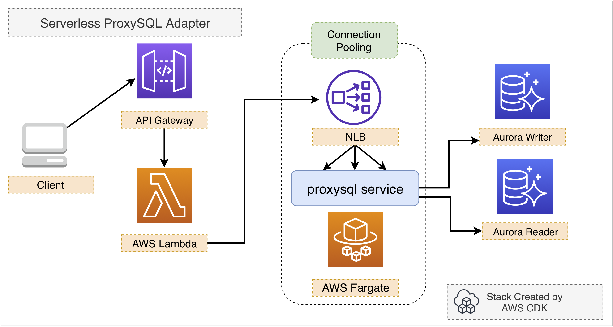

#  Serverless Reference Architecture for ProxySQL

This reference architecture aims to build a serverless connection pooling adapter with proxysql on AWS Fargate and help AWS Lambda better connects to RDS for MySQL or Aurora databases.




# What is ProxySQL

[ProxySQL](https://github.com/sysown/proxysql) is a high performance, high availability, protocol aware proxy for MySQL and forks (like Percona Server and MariaDB). It's a common solution to split SQL reads and writes on Amazon Aurora clusters or RDS for MySQL clusters*.

**How to use ProxySQL with open source platforms to split SQL reads and writes on Amazon Aurora clusters([AWS Blog Post](https://aws.amazon.com/tw/blogs/database/how-to-use-proxysql-with-open-source-platforms-to-split-sql-reads-and-writes-on-amazon-aurora-clusters/))*

# Why ProxySQL on AWS Fargate

AWS Fargate is a serverless compute service that helps container orchestration service such as Amazon ECS  to provision containers without managing any EC2 instances. This repo aims to run ProxySQL in a serverless environment as a middleware between MySQL clients and MySQL clusters.


# Benefits for AWS Lambda

AWS Lambda is a short-lived event-driven serverless computing service. Due to its emphemeral and stateless nature, it's very challenging to build a shared MySQL connection pool in AWS Lambda. However, ProxySQL on AWS Fargate could expose an internal endpoint for all VPC-enabled Lambda functions as a MySQL proxy and split the read/write connections for AWS Lambda as well as help reuse any existing connections when possible. This avoid the overwhelming impact on the backend MySQL or Amazon Aurora cluster when AWS Lambda rapidly scales out.


# How to Deploy

We will deploy this refarch with AWS CDK. Read the [Getting Started](https://docs.aws.amazon.com/cdk/latest/guide/getting_started.html) in AWS CDK Developer Guide and prepare your AWS CDK environment.

When your AWS CDK environment is ready, run the following command to deploy this sample:

```bash
# deploy with AWS CDK
$ cdk --app lib/index.js deploy ProxySQL
```

## License

This library is licensed under the MIT-0 License. See the LICENSE file.

