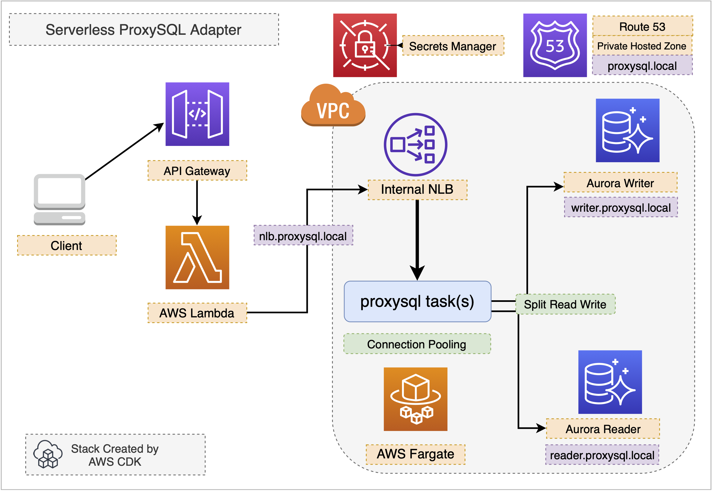

#  Serverless Reference Architecture for ProxySQL

This reference architecture aims to build a serverless connection pooling adapter with proxysql on AWS Fargate and help AWS Lambda better connects to RDS for MySQL or Aurora databases.




# What is ProxySQL

[ProxySQL](https://github.com/sysown/proxysql) is a high performance, high availability, protocol aware proxy for MySQL and forks (like Percona Server and MariaDB). It's a common solution to split SQL reads and writes on Amazon Aurora clusters or RDS for MySQL clusters*.

**How to use ProxySQL with open source platforms to split SQL reads and writes on Amazon Aurora clusters([AWS Blog Post](https://aws.amazon.com/tw/blogs/database/how-to-use-proxysql-with-open-source-platforms-to-split-sql-reads-and-writes-on-amazon-aurora-clusters/))*

# Why ProxySQL on AWS Fargate

AWS Fargate is a serverless compute service that helps container orchestration service such as Amazon ECS  to provision containers without managing any EC2 instances. This repo aims to run ProxySQL in a serverless environment as a middleware between MySQL clients and MySQL clusters.


# Benefits for AWS Lambda

AWS Lambda is a short-lived event-driven serverless computing service. Due to its emphemeral and stateless nature, it's very challenging to build a shared MySQL connection pool in AWS Lambda. However, ProxySQL on AWS Fargate could expose an internal endpoint for all VPC-enabled Lambda functions as a MySQL proxy and split the read/write connections for AWS Lambda as well as help reuse any existing connections when possible. This avoid the overwhelming impact on the backend MySQL or Amazon Aurora cluster when AWS Lambda rapidly scales out.


# How to Deploy

We will deploy this refarch with AWS CDK. Read the [Getting Started](https://docs.aws.amazon.com/cdk/latest/guide/getting_started.html) in AWS CDK Developer Guide and prepare your AWS CDK environment.

When your AWS CDK environment is ready, run the following command to deploy this sample:

```bash
# deploy with AWS CDK
npx cdk synth
npx cdk deploy
```

To deploy in existing VPC,

```bash
# deploy in vpc-123456
npx cdk deploy -c use_vpc_id=vpc-123456
# deploy in the default VPC
npx cdk deply -c use_default_vpc-1
```

### Output Table

| Output Name | Description |
| ----------- | ----------- |
| DBCluster/clusterEndpointHostname | Aurora Endpoint Hostname |
| DBCluster/clusterReadEndpointHostname | Aurora Read Endpoint Hostname |
| DBCluster/clusterIdentifier | Aurora Cluster Identifier |
| DBCluster/DBSecretArn | Secret Manager ARN for Aurora master password |
| ProxySQL/NLBService/LoadBalancerDNS | NLB original DNS name |
| ProxySQL/NLBAliasDN | NLB DNS name alias for privaed hosted zone |
| ProxySQL/ECSClusterName | ECS cluster name |
| ProxySQL/ECSServiceName | ECS service name |


The deployment will create

1. Amazon Aurora for MySQL database cluster with 1 `writer` and 1 `reader`
2. `ProxySQL` running in an AWS Fargate task behind a private NLB(Network Load Balancer) in VPC
3. A private hosted zone `proxysql.local` from Route 53
5. `nlb.proxysql.local` ALIAS to the NLB
6. `writer.proxysql.local` CNAME to the Aurora `writer` instance
7. `reader.proxysql.local` CNAME to the Aurora `reader` instance
9.  password for the `monitor` user generated and stored in AWS Securets Manager
10. password for the Aurora master user `admin` generated and stored in AWS Securets Manager
11. Amazon API Gateway HTTP API with Lambda function with VPC support for demo


After deployment completes, we need setup our backend Aurora cluster as well as the ProxySQL in Fargate. Follow the steps below step by step

1. mysql connect to the `ProxySQL` admin interface
2. connect to backend Aurora and create a `monitor` user
3. make sure the monitoring is working
4. test the mysql read/write on NLB
5. validate on the backend aurora read/write instances


## MySQL connect to the `ProxySQL` admin interface

Copy the `ProxySQLECSClusterName` and `ProxySQLECSServiceName` from the AWS CDK output, replacing `CLUSTER_NAME` and `ECS_SERVICE_NAME` behow

```bash
CLUSTER_NAME='ProxysqlFargateStack-ProxySQLCluster942E58CA-OK0csafRsNab'
ECS_SERVICE_NAME='ProxysqlFargateStack-ProxySQLNLBServiceF6E561D2-YLSBEDPWL3Z8'

TASK_ARN=$(aws ecs list-tasks --cluster ${CLUSTER_NAME} --service-name ${ECS_SERVICE_NAME} \
--query 'taskArns[0]' --output text)

TASK_IP=$(aws ecs describe-tasks --cluster ${CLUSTER_NAME} \
--tasks ${TASK_ARN} \
--output text \
--query 'tasks[0].containers[0].networkInterfaces[0].privateIpv4Address')
```
You should get the ECS task private IP address in `${TASK_IP}`. Simply echo and verify.

```bash
$ echo ${TASK_IP}
172.31.13.157
```
(your `TASK_IP` will be different)


Now we need run `mysql` client from the VPC, you can run an `AWS Cloud9` environment or from any EC2 instances in the same VPC.

```bash
## mysql connect to the proxysql admin interface on Fargate tcp 6032
mysql -uradmin -p -h  ${TASK_IP} -P 6032 --prompt 'ADMIN>'
```

When you see `password:` , go to the `AWS Secrets Manager`, cope and paste the value from the `ProxysqlFargateStack-radmin_pwd` secret and enter the admin shell with the `ADMIN>` prompt.

Let's check the `mysql_server_ping_log`

```sql
ADMIN> SELECT * from monitor.mysql_server_ping_log;
```
You should see a lot of `Access denied` errors as proxysql can't connect to the backend because the `monitor` user does not exists in the backend Aurora.

Please keep this `ADMIN>` terminal open. We will get back to it later.

## Connect to the backend Aurora and create a `monitor` user

Open a seperate terminal and connect to the Aurora writer. Before that, we need  update the master password as we don't know the initial master password.

check the `DBClusterclusterIdentifier` value from the AWS CDK output and replace the value of `DB_IDENTIFIER` below.

Go to AWS Secrets Manager again, find the secret`ProxysqlFargateStack-auroraMasterSecret` and copy its value. Replace the `***` below.

```bash
DB_IDENTIFIER='proxysqlfargatestack-dbclusterdatabased78b6f28-19ylab8pnjlqj'
aws rds modify-db-cluster \
--db-cluster-identifier ${DB_IDENTIFIER} \
--apply-immediately \
--master-user-password ***
```

OK, let's ececute the command and update the master password immediately.

Please note this might take up to 20 seconds for the processing.

After 20 seconds, let's connect the Aurora writer instance
```sh
mysql -u admin -p -h writer.proxysql.local --prompt 'WRITER>'
```
(enter the password we just copied from the AWS Secrets Manager)

If you see the `WRITER>` prompt then you are in the mysql shell of the writer.

Let's create the `monitor` user with the basic `USAGE` privilege.

```sql
WRITER> CREATE USER monitor@'%' IDENTIFIED BY 'monitor';
```

## Make sure the monitor is working

Now, switch back to the `ADMIN>` terminal. Let's check the `mysql_server_ping_log` and `mysql_server_connect_log`. The error message should be `NULL` now, which indicates the `ProxySQL` is able to monitor our backend Aurora instances now.

```sql
SELECT * from monitor.mysql_server_ping_log;
SELECT * from monitor.mysql_server_connect_log;
```
(you should see some `NULL` in the )


## Test the mysql read/write through the NLB

Let's open yet another seperate terminal. We'll connect through NLB to the real backend.

```bash
mysql -u admin -p -h nlb.proxysql.local --prompt 'NLB>'
```
(cope and paste the value of `ProxysqlFargateStack-auroraMasterSecret` as the password from the AWS Secrets Manager)

You should be able the see the `NLB>` prompt now.


Let's create a `demo` database and `tasks` table in it.
```sql
NLB> CREATE DATABASE demo;
NLB> USE demo;
NLB> CREATE TABLE IF NOT EXISTS tasks (
    task_id INT AUTO_INCREMENT PRIMARY KEY,
    title VARCHAR(255) NOT NULL,
    created_at TIMESTAMP DEFAULT CURRENT_TIMESTAMP);
NLB> INSERT INTO `tasks` (`title`) VALUES ('foo');
NLB> SELECT * FROM tasks;
```

Now get back to the `WRITER>` terminal

```sql
WRITER> use demo;
WRITER> SELECT * FROM tasks;
WRITER> INSERT INTO `tasks` (`title`) VALUES ('bar');
WRITER> SELECT * FROM tasks;
```

Now get back to the `NLB>` terminal

```sql
WRITER> SELECT * FROM demo.tasks;
```
The content should be all in sync.

## Connect to the Aurora reader

You may also open another terminal connecting to the Aurora reader directly.

```sh
mysql -u admin -p -h reader.proxysql.local --prompt 'READER>'
```

```sql
READER> SELECT * FROM demo.tasks;
```

The content from the reader should be exactly the same.


## Clean up and destroy

Run `cdk destroy` to tear down the whole stack.

```bash
npx cdk destroy
```

## License

This library is licensed under the MIT-0 License. See the LICENSE file.

